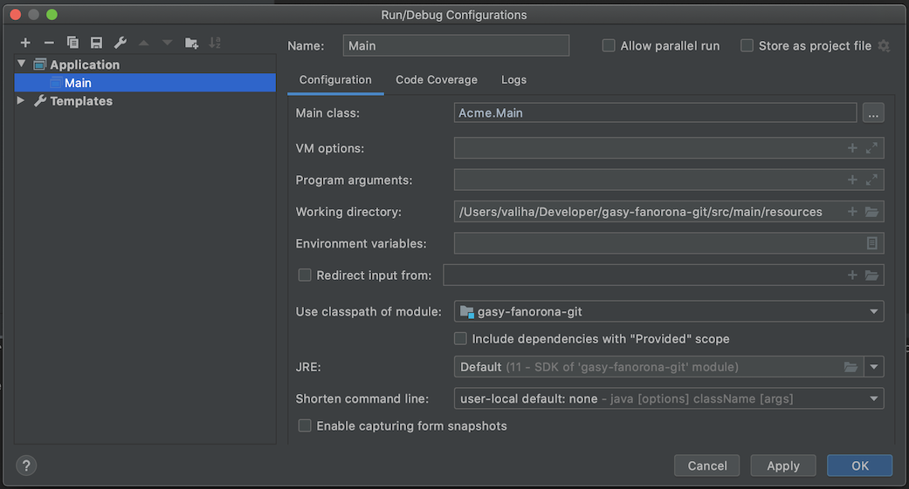

# Fanorona

# :x: This project has been archived see [:point_right: Fanorona](https://github.com/gasy-africa/fanorona)

Use Maven to generate the jar and class files

```
$ mvn package
```

To run the app got to the `target/classes` folder and run `java`:

```
cd target/classes; java -Dfile.encoding=UTF-8 -classpath . Acme.Main; cd -
```

:round_pushpin: Running the tests use the below command:

```
$ mvn --batch-mode test --file pom.xml
```

:round_pushpin: Use IntelliJ to run the app with Maven

To run change the Run config using the following settings




